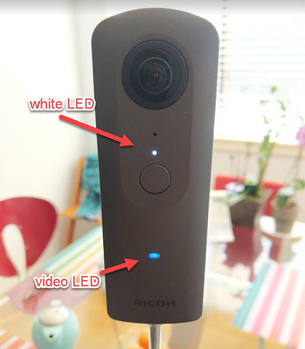

# Surveillance 2K Plug-in for RICOH THETA

Takes long 2K videos of over 4 hours without a mobile phone or laptop. 
Video is stored to camera internal storage. You may need to connect 
the camera to a portable battery for long shoots.

## Video Quality is Lower

This plug-in will take low quality 2K videos for surveillance
or monitoring purposes.

To reduce file size and save longer videos to internal storage, the
following techniques are used:

* video resolution is 1920x960, not the standard camera resolution of 3840x1920
* Using 15fps instead of 30fps
* Using 8 Mbps video encoding bitrate, not 32 Mbps

## Max Video File Size

Maximum video file size is 19GB. Delete all other files from your camera
if you want to take the longest video possible.

## Managing Camera Files from your Computer

### List Files

        adb shell ls /sdcard/DCIM/

### Transfer Files

        adb pull /sdcard/DCIM/surveillance_20180916173614.mp4

### Remove Files From Camera

        adb shell rm /sdcard/DCIM/*.mp4

This sample plug-in is based on the 
[CameraAPI Capture plug-in from Ricoh](https://github.com/ricohapi/theta-plugin-camera-api-sample).  

The plug-in should be installed into the RICOH THETA V with adb.

See this link for more information:

https://community.theta360.guide/t/theta-v-48-minute-4k-video-and-77-minute-2k-video-working/3483?u=codetricity

